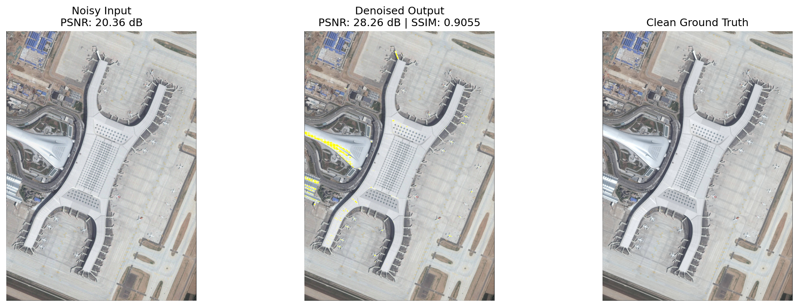
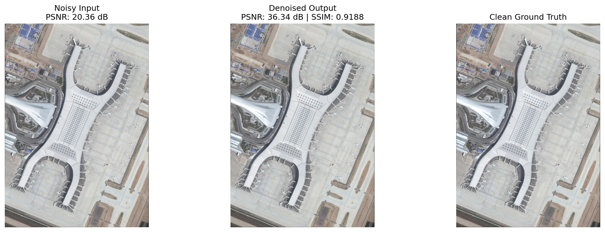
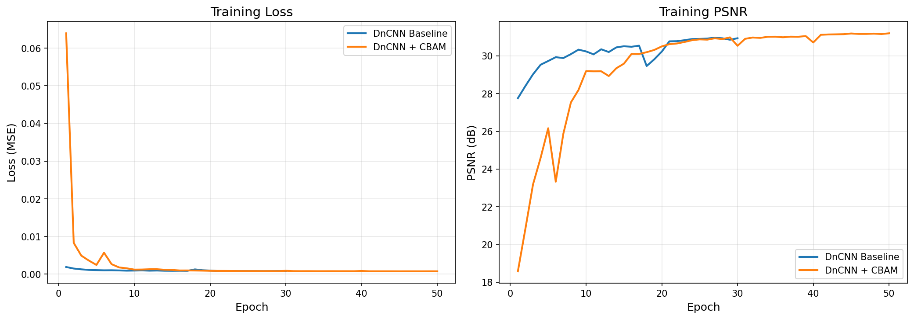
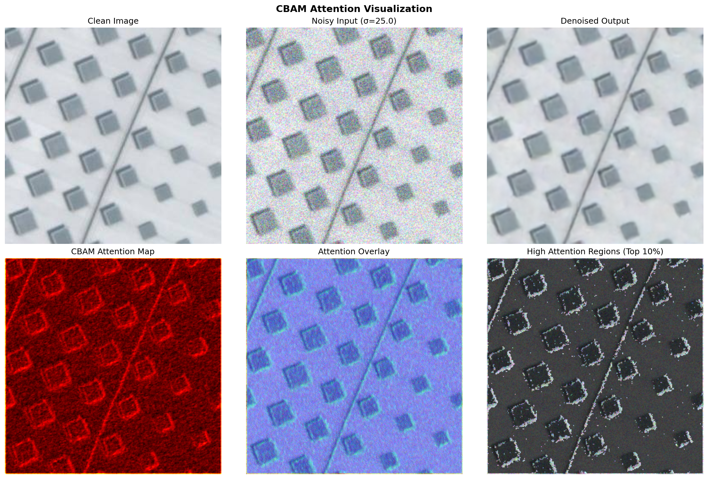

# DnCNN + CBAM 遥感图像降噪网络

> 基于深度学习的遥感图像去噪方法，结合 CBAM 注意力机制保护小目标细节

## 📊 实验结果

| 模型 | 参数量 | 测试 PSNR | SSIM | 相比 Baseline |
|------|--------|-----------|------|---------------|
| DnCNN Baseline | 558,336 | 28.26 dB | 0.9055 | - |
| **DnCNN + CBAM** | 558,946 | **36.34 dB** | **0.9189** | **+8.08 dB** |

### 可视化对比

<table>
<tr>
<td><br><center>Baseline 降噪效果</center></td>
<td><br><center>CBAM 降噪效果</center></td>
</tr>
</table>

### 训练曲线



---

## 🏗️ 项目结构

```
毕设项目/
├── data/
│   └── train/                    # DOTA 遥感数据集 (1411 张图)
├── src/                          # 核心源代码
│   ├── dataset.py               # 数据加载与预处理
│   ├── model.py                 # DnCNN + CBAM 网络定义
│   ├── train.py                 # 训练脚本
│   ├── eval.py                  # 评估与可视化
│   ├── plot_curves.py           # 训练曲线绘制
│   ├── ablation_noise.py        # 噪声消融实验
│   └── visualize_attention.py   # CBAM 注意力热力图
├── experiments/                  # 实验结果
│   ├── baseline_50ep/           # Baseline 模型权重与结果
│   ├── cbam_50ep/               # CBAM 模型权重与结果
│   ├── ablation/                # 消融实验结果
│   ├── comparison_curves.png    # 训练曲线对比图
│   └── RESULTS.md               # 完整实验报告
├── tests/
│   └── test_forward.py          # 显存安全测试
├── requirements.txt             # Python 依赖
└── README.md                    # 本文档
```

---

## 🔧 环境配置

### 硬件要求
- GPU: NVIDIA RTX 3050 (4GB) 或更高
- RAM: 8GB+
- 存储: 10GB+ (含数据集)

### 软件依赖

```bash
# 创建 Conda 环境
conda create -n rs_denoise python=3.10 -y
conda activate rs_denoise

# 安装 PyTorch (CUDA 11.8)
pip install torch torchvision --index-url https://download.pytorch.org/whl/cu118

# 安装其他依赖
pip install -r requirements.txt
```

---

## 🚀 快速开始

### 1. 训练模型

```bash
# Baseline 模型
python src/train.py --exp_name baseline --epochs 50

# CBAM 注意力模型 (推荐)
python src/train.py --exp_name cbam --epochs 50 --use_attention

# 从 checkpoint 恢复训练
python src/train.py --exp_name cbam --epochs 50 --use_attention --resume experiments/cbam/weights/epoch_20.pth
```

### 2. 评估模型

```bash
python src/eval.py \
    --weights experiments/cbam_50ep/weights/best.pth \
    --image data/train/P0000.jpg \
    --output result.png \
    --use_attention
```

### 3. 运行消融实验

```bash
python src/ablation_noise.py \
    --weights experiments/cbam_50ep/weights/best.pth \
    --use_attention \
    --output_dir experiments/ablation
```

### 4. 生成注意力热力图

```bash
python src/visualize_attention.py \
    --weights experiments/cbam_50ep/weights/best.pth \
    --output experiments/attention_map.png
```

---

## 📁 核心代码说明

### `src/dataset.py` - 数据加载

```python
# 核心功能:
# - 随机裁剪 64×64 patches
# - 动态添加高斯噪声 (σ=25)
# - 方差过滤: 跳过低对比度 patches
# - 返回 (noisy, clean) 图像对
```

**关键参数**:
| 参数 | 默认值 | 说明 |
|------|--------|------|
| `patch_size` | 64 | 裁剪块大小 |
| `noise_sigma` | 25.0 | 噪声标准差 |
| `min_variance` | 0.01 | 方差过滤阈值 |

### `src/model.py` - 网络结构

```
DnCNN-17 架构:
├── Conv + ReLU (输入层)
├── [Conv + BN + ReLU] × 7 (特征提取)
├── CBAM 注意力模块 (可选)
├── [Conv + BN + ReLU] × 8 (特征提取)
└── Conv (输出层, 残差学习)
```

**CBAM 模块**:
- **通道注意力**: 全局平均池化 + MLP → 通道权重
- **空间注意力**: 通道压缩 + 7×7 卷积 → 空间权重

### `src/train.py` - 训练流程

```
训练流程:
1. 加载数据 (DataLoader, batch_size=8)
2. 初始化模型 (DnCNN + 可选 CBAM)
3. 优化器: Adam (lr=1e-3)
4. 学习率调度: StepLR (每20轮衰减0.5)
5. 损失函数: MSELoss
6. 每 10 轮保存 checkpoint
7. 记录最佳 PSNR 模型
```

### `src/eval.py` - 评估与可视化

```
评估流程:
1. 加载图像并添加噪声
2. 分块降噪 (64×64 patches)
3. 计算 PSNR / SSIM 指标
4. 生成三列对比图: [含噪 | 降噪 | 真值]
```

---

## 📈 实验详情

### 噪声鲁棒性消融

| σ | 含噪 PSNR | 降噪后 PSNR | SSIM | 提升 |
|---|-----------|-------------|------|------|
| 15 | 24.65 dB | 33.66 dB | 0.9153 | +9.00 dB |
| 25 | 20.24 dB | 33.45 dB | 0.8996 | +13.21 dB |
| 35 | 17.36 dB | 27.55 dB | 0.6035 | +10.19 dB |
| 50 | 14.45 dB | 14.57 dB | 0.0991 | +0.12 dB |

> 模型在 σ ≤ 35 时有效，σ = 50 时接近失效 (仅在 σ=25 训练)

### CBAM 注意力可视化



**发现**: CBAM 自动聚焦于建筑物边缘、小型地面目标和纹理复杂区域。

---

## 📝 论文框架

```
第1章 绪论
├── 1.1 研究背景与意义
├── 1.2 国内外研究现状
│   ├── 传统滤波方法 (中值滤波、高斯滤波、BM3D)
│   ├── 深度学习方法 (DnCNN, FFDNet, RNAN)
│   └── 注意力机制在图像处理中的应用
└── 1.3 研究内容与论文结构

第2章 相关理论基础
├── 2.1 图像噪声模型
├── 2.2 卷积神经网络基础
├── 2.3 残差学习
└── 2.4 注意力机制
    ├── SE-Net (通道注意力)
    └── CBAM (通道+空间注意力)

第3章 基于注意力机制的遥感图像降噪方法
├── 3.1 整体框架设计
├── 3.2 DnCNN 基础网络
├── 3.3 CBAM 模块设计
├── 3.4 损失函数与训练策略
└── 3.5 数据增强策略

第4章 实验与结果分析
├── 4.1 实验环境与数据集
├── 4.2 评价指标 (PSNR, SSIM)
├── 4.3 Baseline 与 CBAM 对比实验
├── 4.4 噪声鲁棒性消融实验
├── 4.5 注意力可视化分析
└── 4.6 与其他方法对比

第5章 总结与展望
├── 5.1 研究总结
├── 5.2 创新点
└── 5.3 未来工作
```

---

## 🔗 参考文献

1. Zhang K, et al. "Beyond a Gaussian Denoiser: Residual Learning of Deep CNN for Image Denoising" (DnCNN, 2017)
2. Woo S, et al. "CBAM: Convolutional Block Attention Module" (CBAM, 2018)
3. Zhang Y, et al. "Residual Non-local Attention Networks for Image Restoration" (RNAN, 2019)

---

## 📄 License

MIT License

## 👤 作者

毕业设计项目 - 遥感图像去噪
